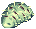
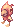

# 📔 เปลี่ยน Expanded Novice

### <mark style="color:red;">เงื่อนไข</mark>

#### <mark style="color:purple;">ตัวละคร</mark>

* Base Level: 99
* Job Level: 99
* Job Class: Super Novice

#### <mark style="color:purple;">อื่นๆ</mark>

* เงินจำนวนขั้นต่ำ 100,000z

#### <mark style="color:green;">รางวัลจากเควส</mark>

* กรณีบริจาก 100,000z
  *  [Novice Breastplate \[1\]](https://www.divine-pride.net/database/item/2340/novice-breastplate-1) 1 ea&#x20;
* กรณีบริจาก 300,000z
  *  [Undershirt](https://www.divine-pride.net/database/item/2522/undershirt) 1 ea&#x20;
* กรณีบริจาก 1,000,000z
  *  [Super Novice Hat \[1\]](https://www.divine-pride.net/database/item/5119/super-novice-hat-1) 1 ea
  *  [Novice Breastplate \[1\]](https://www.divine-pride.net/database/item/2340/novice-breastplate-1) 1 ea&#x20;
  *  [Novice Manteau \[1\]](https://www.divine-pride.net/database/item/2512/novice-manteau-1) 1ea
  *  [Novice Shield \[1\]](https://www.divine-pride.net/database/item/2113/novice-shield-1) 1 ea
  *  [Novice Shoes \[1\]](https://www.divine-pride.net/database/item/2416/novice-shoes-1) 1 ea
  *  [Novice Armlet \[1\]](https://www.divine-pride.net/database/item/2628/novice-armlet-1) 1 ea

### <mark style="color:yellow;">ขั้นตอนการเดินเควส</mark>

* เดินทางไปเมือง Al De Baran เข้าไปในบ้านที่พิกัด  `/navi aldebaran 116/63`
* เข้าห้องทางด้านซ้าย
* คุยกับ Esere เลือก "**ข้าอยากแข็งแกร่งกว่านี้ ดังนั้นรีบมาเร็ว!!"**

* เดินทางไปพบ a novice in fishing ที่ `/navi beach_dun2 119/92`&#x20;

* คุยเรื่อยๆแล้วตอบ  "**เจ้าเป็นใครกัน? คริ คริ คริ\~"**
* ตัวเลือกถัดไปเลือก "**ข้าจะทำมัน.. . แน่นอน"**
* เขาจะให้เราทำการล่ามอนสเตอร์จำนวน 1,000 ตัว
* โดยสุ่มระหว่าง&#x20;
  *   [Poring](https://www.divine-pride.net/database/monster/1002)&#x20;
  *  [Fabre](https://www.divine-pride.net/database/monster/1007/fabre)
  *  [Lunatic](https://www.divine-pride.net/database/monster/1063/lunatic)
  *  [Picky](https://www.divine-pride.net/database/monster/1049/picky) <mark style="color:red;">\*ต้องเป็นตัวที่ไม่ใส่หมวกไข่</mark>
* เมื่อล่ามอนสเตอร์ครบแล้วให้กลับมาหาเขา&#x20;
* เลือกตอบเป็นชื่อ Monster ที่เราได้รับมอบหมาย
* คุยกับเขาซ้ำๆ  จนกว่าเขาจะบอกว่าได้รับจดหมาย
* จากนั้นเขาจะให้เราไปพบพี่น้องที่ไม่ได้เจอมานาน
* ให้เราไปขึ้น Airship (เรือเหาะ) จากที่ไหนก็ได้ใน 4 ที่นี้
  * Juno
  * Hugel
  * Einbroch
  * Lighthalzen
* จากนั้นเข้าวาปทางด้านขวา คุยกับ Nudor ที่ `/navi airplane 33/47`

* เลือกบริจาคเงินให้เขา <mark style="color:red;">\*เลือกราคาไหนก็ได้ตามงบที่มี</mark>
* กลับไปหา Nodor อีกครั้ง เราจะได้รับการเปลี่ยนอาชีพ

> อ้างอิงจาก: [www.ro-prt.in.th](https://ro-prt.in.th/forum/index.php?app=forums\&module=forums\&controller=topic\&id=27567)
