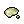

# 📔 เปลี่ยน Super Novice

### <mark style="color:red;">สิ่งที่ต้องเตรียม</mark>

#### <mark style="color:purple;">ตัวละคร</mark>

Base Level: 45

Job Level: 10

Job Class: Novice

#### <mark style="color:purple;">ไอเทมที่ต้องเตรียม</mark>

 30 [Resin](http://db.irowiki.org/db/item-info/907/)

 30 [Sticky Mucus](http://db.irowiki.org/db/item-info/938/)

#### <mark style="color:green;">รางวัลจากเควส</mark>

 [Pantie](http://db.irowiki.org/db/item-info/2339/)

### <mark style="color:yellow;">ขั้นตอนการเดินเควส</mark>

* เดินทางไปที่เมือง  Al De Baran ที่พิกัด `/navi aldebaran 116/63`
* เมื่อเข้าไปแล้วให้เดินไปทางห้อง ซ้ายมือ
* คุยกับ **Tzerero**  เลือกข้อ 1 "ฟังดูเท่จริง\~"

********

* เขาจะขอ
  1.  30 [Resin](http://db.irowiki.org/db/item-info/907/)
  2.  30 [Sticky Mucu](http://db.irowiki.org/db/item-info/938/)
* เมื่อเตรียมมาแล้วให้คุยอีกทีครั้ง แล้วเลือก ข้อ 1 คุณก็จะสามารถเปลี่ยน Super Novice ได้ทันที
